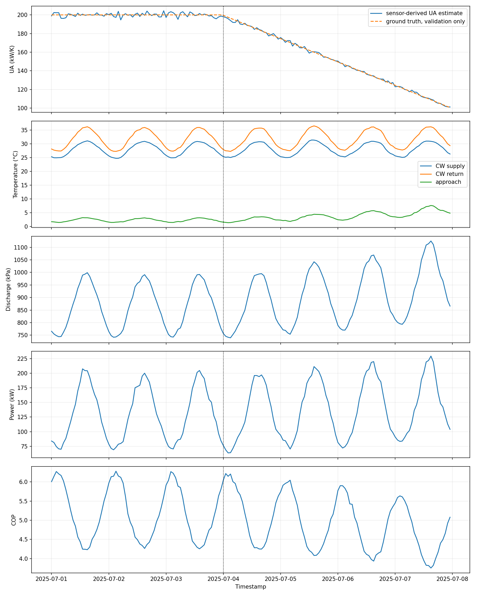
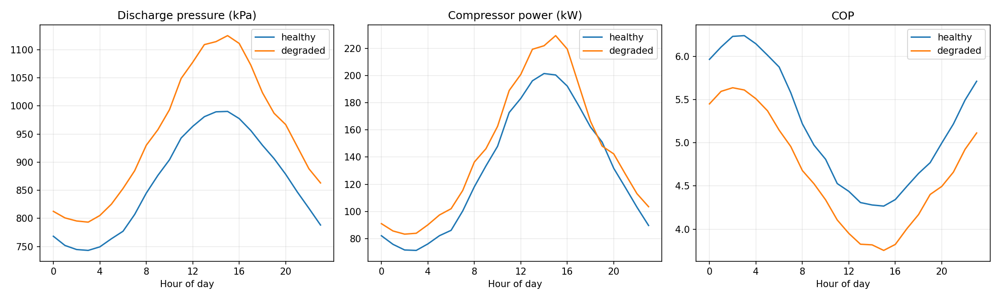
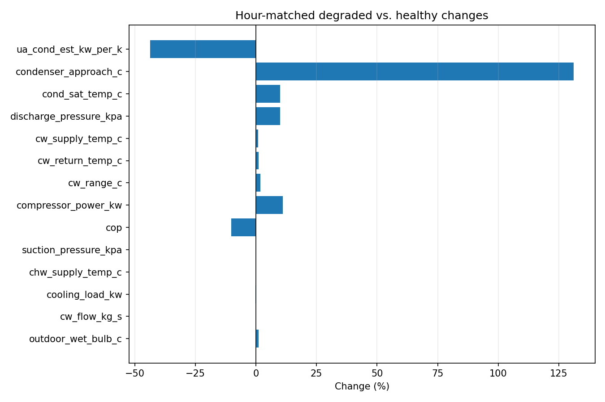
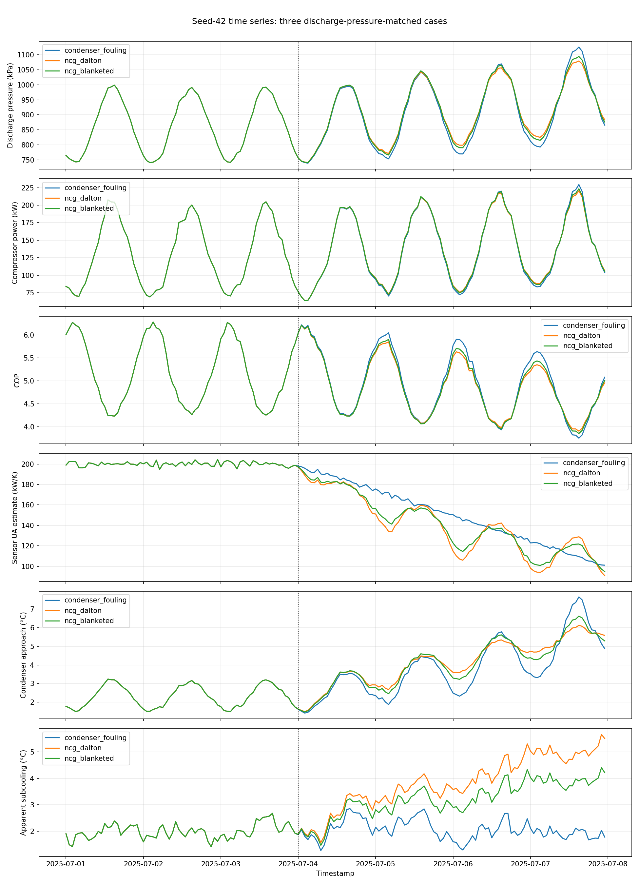
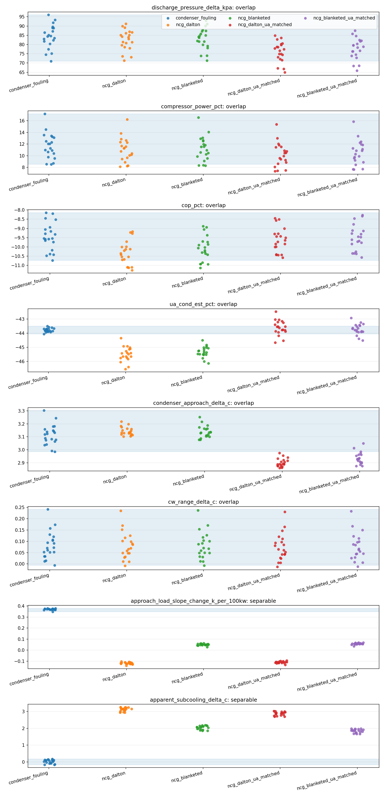
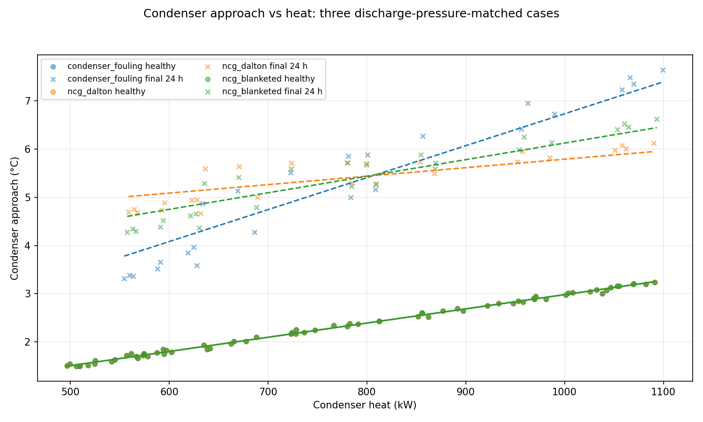

# Chiller Diagnostic Report

## Assumptions

This analysis uses the steady-state synthetic chiller model and the sensor
noise specified in the project documentation. The comparison windows are
selected from the documented fault schedule: the healthy period ends at the
scheduled fault start and the degraded period is the final 24 hours. Diagnosis
and comparisons use measured sensor columns only; ground-truth labels are
reserved for validation.

## Fault schedule

The simulated condenser fouling ramp starts at `2025-07-04 00:00` and reaches
50% UA loss at the final sample, compressing a fault that would typically
develop over weeks to months into four days.

## Measured changes

The table compares hour-of-day-matched means for healthy operation and the
final 24 hours. Slopes are load- and weather-adjusted hourly trend estimates.

<!-- BEGIN GENERATED: measured-changes -->

| signal | healthy | degraded | Δ | Δ% | healthy slope/day | fault slope/day |
| --- | --- | --- | --- | --- | --- | --- |
| ua_cond_est_kw_per_k | 199.992 | 112.716 | -87.276 | -43.640% | -0.080 | -24.755 |
| condenser_approach_c | 2.315 | 5.352 | 3.037 | 131.194% | 0.000 | 0.884 |
| cond_sat_temp_c | 33.914 | 37.269 | 3.355 | 9.892% | 0.002 | 0.897 |
| discharge_pressure_kpa | 862.507 | 948.674 | 86.167 | 9.990% | -0.149 | 22.603 |
| cw_supply_temp_c | 27.900 | 28.153 | 0.253 | 0.908% | 0.005 | -0.002 |
| cw_return_temp_c | 31.599 | 31.917 | 0.318 | 1.005% | 0.001 | 0.013 |
| cw_range_c | 3.700 | 3.764 | 0.064 | 1.740% | -0.004 | 0.015 |
| compressor_power_kw | 130.191 | 144.500 | 14.309 | 10.990% | -0.193 | 3.286 |
| cop | 5.193 | 4.661 | -0.532 | -10.248% | -0.005 | -0.146 |
| suction_pressure_kpa | 341.070 | 341.167 | 0.098 | 0.029% | — | — |
| chw_supply_temp_c | 7.001 | 6.999 | -0.002 | -0.026% | — | — |
| cooling_load_kw | 644.488 | 642.778 | -1.711 | -0.265% | — | — |
| cw_flow_kg_s | 50.009 | 50.020 | 0.011 | 0.023% | — | — |
| outdoor_wet_bulb_c | 23.899 | 24.158 | 0.259 | 1.083% | — | — |

<!-- END GENERATED: measured-changes -->

Across the full four-day fault window, the measured discharge-pressure, power,
and COP effects are about half the final-24-hour changes: approximately
`+43 kPa`, `+6.3%`, and `−5.3%`. The final-24-hour CW-return increase of
`+0.318 °C` is mostly weather-related: CW supply rose `+0.253 °C` (wet bulb
`+0.259 °C`). The fault's own condenser-water range rise is about `+0.07 °C`,
consistent with `ΔW/(m_cw·cp) = 14.3/209.3`.

## Diagnostic reasoning

The sensor-derived causal chain is decreasing condenser UA → increasing
condenser approach → increasing condensing saturation temperature and discharge
pressure → increasing lift → decreasing COP → increasing compressor power,
with a slight increase in CW range. Suction pressure, chilled-water supply,
cooling load, and flow remain approximately unchanged in the final-24-hour
matched comparison.

| Hypothesis | Expected signature | Consistent | Notes |
|---|---|---:|---|
| Condenser heat-transfer degradation | UA estimate falls while approach and discharge pressure rise | Yes | Consistent with waterside fouling or scaling |
| Elevated CW supply / tower-weather | CW supply rise accounts for condensing-temperature rise; approach stays small | No | Does not explain the measured approach increase |
| Reduced CW flow | CW flow decreases by at least 5% | No | Flow is approximately unchanged |
| Evaporator-side fault or refrigerant undercharge | Suction pressure falls by at least 10 kPa | No | Suction pressure is approximately unchanged |
| Increased cooling load | Cooling load increases by at least 6% | No | Cooling load is approximately unchanged |
| Non-condensables in the condenser | Condenser pressure and approach rise with apparent UA loss | Yes | These sensors can't tell it apart from fouling; it would need a refrigerant liquid temperature vs. saturation check, or purge history |

Conclusion: the data support condenser heat-transfer degradation. Non-condensables
cannot be excluded by these sensors alone.

## Validation against ground truth

The sensor-only UA estimate agrees with the ground-truth daily mean UA to
within 3% on each day. The estimates are approximately `199.95`, `200.11`,
`199.92`, `186.95`, `162.54`, `137.64`, and `112.62 kW/K`, compared with
ground truth `200`, `200`, `200`, `187.5`, `162.5`, `137.5`, and `112.5 kW/K`.
The condenser approach grows from approximately `2.3 °C` to `5.4 °C` by day 7.
Ground truth is shown only in the validation trace below.







## Limitations

The fault ramp is accelerated to four days rather than its weeks-to-months
physical timescale. The simulation is synthetic and steady-state, with no
transient equipment dynamics, fixed water flows, and a constant tower
approach. This report uses one random seed; the regression tests separately
exercise multiple seeds.

## Test weakness and recovery

The original single-seed direction test used CW return temperature and a tight
cooling-load tolerance. CW return was confounded by wet-bulb AR(1) drift
between the comparison windows (about ±0.19 °C), larger than the fault's own
approximately `+0.07 °C` CW-range effect. The exogenous cooling-load AR(1)
variation also moved the window mean independently of the fault. The 50-seed
regression produced this failure summary:

```text
FAILED tests/test_telemetry.py::test_degradation_direction_across_seeds[3] - ...
FAILED tests/test_telemetry.py::test_degradation_direction_across_seeds[4] - ...
FAILED tests/test_telemetry.py::test_degradation_direction_across_seeds[12]
FAILED tests/test_telemetry.py::test_degradation_direction_across_seeds[14]
FAILED tests/test_telemetry.py::test_degradation_direction_across_seeds[15]
FAILED tests/test_telemetry.py::test_degradation_direction_across_seeds[21]
FAILED tests/test_telemetry.py::test_degradation_direction_across_seeds[24]
FAILED tests/test_telemetry.py::test_degradation_direction_across_seeds[29]
FAILED tests/test_telemetry.py::test_degradation_direction_across_seeds[30]
FAILED tests/test_telemetry.py::test_degradation_direction_across_seeds[34]
FAILED tests/test_telemetry.py::test_degradation_direction_across_seeds[35]
FAILED tests/test_telemetry.py::test_degradation_direction_across_seeds[36]
FAILED tests/test_telemetry.py::test_degradation_direction_across_seeds[38]
FAILED tests/test_telemetry.py::test_degradation_direction_across_seeds[39]
FAILED tests/test_telemetry.py::test_degradation_direction_across_seeds[41]
FAILED tests/test_telemetry.py::test_degradation_direction_across_seeds[43]
FAILED tests/test_telemetry.py::test_degradation_direction_across_seeds[44]
>       assert deltas["cw_return_temp_c"] > 0.0
E       assert -0.22050713544261713 > 0.0

17 failed, 39 passed in 1.70s
```

The cooling-load difference is exogenous AR(1) variation, with a 1.6% standard
deviation and a 4.7% maximum over the verified 200-seed set.

Recovery: retain the pressure, power, COP, suction, and chilled-water checks;
use condenser approach and sensor-only UA loss instead of CW return as the
fault-specific signals, and allow a 6% cooling-load difference to accommodate
the documented exogenous noise. The telemetry suite passed after this change:
`56 passed in 1.79s`.

## Reproduce

```bash
pip install -r requirements.txt
python -m chiller_sim --seed 42 --output data/chiller_telemetry.csv
python -m chiller_sim.report
python -m chiller_sim.separation
python -m chiller_sim.sweeps
python -m pytest -q
```

## Second fault: non-condensable gas vs condenser fouling

### Stated before implementation

Before coding, I expected current-sensor level metrics to overlap once the
discharge-pressure rise was matched. The load dependence of condenser approach
was a candidate separator: partial-pressure-dominated NCG may add a roughly
load-independent pressure offset, while fouling adds a load-proportional
thermal resistance. This depends on the balance of partial pressure and tube
blanketing, so the data decide whether it separates. The smallest physical
separator considered was a condenser liquid-refrigerant temperature sensor,
used to estimate apparent subcooling as saturation temperature at discharge
pressure minus liquid temperature.

### NCG model and calibration

The NCG branch uses Dalton's law:

```text
progress = clip((t - t_fault)/(t_last - t_fault), 0, 1)
p_ncg = p_ncg,max * progress
UA_c = UA_c,healthy * (1 - blanketing_loss * progress)
P_total = P_sat(T_cond) + p_ncg
T_lift = T_sat(P_total)
COP_true = η(PLR) * (T_evap + 273.15)/(T_lift - T_evap)
```

The Dalton-only case leaves condenser UA at its healthy value. The blanketed
case adds a 25% UA loss at full progress. At seed 42, bisection calibrates two
pairs of partial-pressure maxima: the discharge-pressure-matched cases
(`P_A = 89.2 kPa` with no blanketing, `P_B = 58.8 kPa` with 25% blanketing)
match the fouling reference's `+86.167 kPa` discharge-pressure delta. The
UA-estimate-matched cases (`P_C = 82.1 kPa` with no blanketing,
`P_D = 52.9 kPa` with 25% blanketing) match its final-24-hour UA-estimate
percentage change. All values are rounded to 0.1 kPa.

One condenser liquid-temperature sensor is added. Its modeled subcooling is
`clip(2.0 + 1.0*(PLR - 0.65) + AR1(phi=0.95, sd=0.3 °C), 0.2, ∞)`, with
independent measurement noise of `0.05 °C`. Its random stream is seeded
separately from the original sensors. Apparent subcooling is
`T_sat(P_discharge) - T_liquid`; the NCG partial pressure raises saturation
temperature while the liquid temperature follows the modeled condenser
temperature.

### Schedule and shared baseline

Both faults begin at `2025-07-04 00:00` and follow the same linear ramp through
the final sample. The original fouling path and RNG stream are unchanged.
Fouling and Dalton-only NCG use the same seed-driven exogenous trajectories;
the independent liquid-sensor stream is also the same for both cases. Thus
the sensor baseline before fault start is shared.

### Generated separation results

<!-- BEGIN GENERATED: fault-separation -->

### Calibration and seed-42 comparison

| case | calibration target | max NCG partial pressure (kPa) | blanketing UA loss | discharge pressure Δ (kPa) | UA estimate Δ (%) | diagnose() mechanism |
| --- | --- | ---: | ---: | ---: | ---: | --- |
| condenser_fouling | reference | 0.000 | 0.000 | 86.167 | -43.639 | condenser heat-transfer degradation (waterside fouling/scaling) |
| ncg_dalton | discharge pressure | 89.200 | 0.000 | 86.124 | -45.528 | condenser heat-transfer degradation (waterside fouling/scaling) |
| ncg_blanketed | discharge pressure | 58.800 | 0.250 | 86.205 | -45.260 | condenser heat-transfer degradation (waterside fouling/scaling) |
| ncg_dalton_ua_matched | UA estimate | 82.100 | 0.000 | 79.714 | -43.640 | condenser heat-transfer degradation (waterside fouling/scaling) |
| ncg_blanketed_ua_matched | UA estimate | 52.900 | 0.250 | 80.843 | -43.649 | condenser heat-transfer degradation (waterside fouling/scaling) |

### Seed-sweep ranges and interval gaps

| metric | source | fouling range | NCG case | NCG range | gap | separable |
| --- | --- | ---: | --- | ---: | ---: | --- |
| discharge_pressure_delta_kpa | current sensors | 71.010–96.042 | ncg_dalton | 71.332–91.269 | -20.259 | no |
| discharge_pressure_delta_kpa | current sensors | 71.010–96.042 | ncg_blanketed | 71.296–92.912 | -21.902 | no |
| discharge_pressure_delta_kpa | current sensors | 71.010–96.042 | ncg_dalton_ua_matched | 64.922–84.849 | -13.839 | no |
| discharge_pressure_delta_kpa | current sensors | 71.010–96.042 | ncg_blanketed_ua_matched | 65.934–87.541 | -16.531 | no |
| compressor_power_pct | current sensors | 8.547–17.195 | ncg_dalton | 8.126–16.223 | -7.677 | no |
| compressor_power_pct | current sensors | 8.547–17.195 | ncg_blanketed | 8.322–16.559 | -8.012 | no |
| compressor_power_pct | current sensors | 8.547–17.195 | ncg_dalton_ua_matched | 7.337–15.392 | -6.846 | no |
| compressor_power_pct | current sensors | 8.547–17.195 | ncg_blanketed_ua_matched | 7.663–15.865 | -7.319 | no |
| cop_pct | current sensors | -10.741–-8.144 | ncg_dalton | -11.266–-9.166 | -1.575 | no |
| cop_pct | current sensors | -10.741–-8.144 | ncg_blanketed | -11.142–-8.879 | -1.862 | no |
| cop_pct | current sensors | -10.741–-8.144 | ncg_dalton_ua_matched | -10.584–-8.450 | -2.291 | no |
| cop_pct | current sensors | -10.741–-8.144 | ncg_blanketed_ua_matched | -10.570–-8.275 | -2.426 | no |
| ua_cond_est_pct | current sensors | -44.066–-43.494 | ncg_dalton | -46.543–-44.345 | 0.279 | yes |
| ua_cond_est_pct | current sensors | -44.066–-43.494 | ncg_blanketed | -46.130–-44.494 | 0.428 | yes |
| ua_cond_est_pct | current sensors | -44.066–-43.494 | ncg_dalton_ua_matched | -44.671–-42.472 | -1.176 | no |
| ua_cond_est_pct | current sensors | -44.066–-43.494 | ncg_blanketed_ua_matched | -44.519–-42.922 | -1.025 | no |
| condenser_approach_delta_c | current sensors | 2.985–3.302 | ncg_dalton | 3.103–3.217 | -0.199 | no |
| condenser_approach_delta_c | current sensors | 2.985–3.302 | ncg_blanketed | 3.078–3.251 | -0.225 | no |
| condenser_approach_delta_c | current sensors | 2.985–3.302 | ncg_dalton_ua_matched | 2.861–2.977 | 0.009 | yes |
| condenser_approach_delta_c | current sensors | 2.985–3.302 | ncg_blanketed_ua_matched | 2.875–3.051 | -0.065 | no |
| cw_range_delta_c | current sensors | -0.007–0.241 | ncg_dalton | -0.008–0.235 | -0.242 | no |
| cw_range_delta_c | current sensors | -0.007–0.241 | ncg_blanketed | -0.008–0.237 | -0.244 | no |
| cw_range_delta_c | current sensors | -0.007–0.241 | ncg_dalton_ua_matched | -0.013–0.230 | -0.236 | no |
| cw_range_delta_c | current sensors | -0.007–0.241 | ncg_blanketed_ua_matched | -0.012–0.233 | -0.239 | no |
| approach_load_slope_change_k_per_100kw | current sensors | 0.348–0.380 | ncg_dalton | -0.142–-0.103 | 0.452 | yes |
| approach_load_slope_change_k_per_100kw | current sensors | 0.348–0.380 | ncg_blanketed | 0.027–0.062 | 0.287 | yes |
| approach_load_slope_change_k_per_100kw | current sensors | 0.348–0.380 | ncg_dalton_ua_matched | -0.133–-0.095 | 0.444 | yes |
| approach_load_slope_change_k_per_100kw | current sensors | 0.348–0.380 | ncg_blanketed_ua_matched | 0.036–0.069 | 0.279 | yes |
| apparent_subcooling_delta_c | added liquid-temperature sensor | -0.158–0.180 | ncg_dalton | 2.932–3.255 | 2.751 | yes |
| apparent_subcooling_delta_c | added liquid-temperature sensor | -0.158–0.180 | ncg_blanketed | 1.857–2.184 | 1.677 | yes |
| apparent_subcooling_delta_c | added liquid-temperature sensor | -0.158–0.180 | ncg_dalton_ua_matched | 2.694–3.018 | 2.513 | yes |
| apparent_subcooling_delta_c | added liquid-temperature sensor | -0.158–0.180 | ncg_blanketed_ua_matched | 1.659–1.987 | 1.479 | yes |

Claimed separators (disjoint from fouling for every NCG variant): approach_load_slope_change_k_per_100kw, apparent_subcooling_delta_c.
Overlapping or not robust: discharge_pressure_delta_kpa, compressor_power_pct, cop_pct, ua_cond_est_pct, condenser_approach_delta_c, cw_range_delta_c.

Seed-42 `diagnose()` mechanisms:
- condenser_fouling: condenser heat-transfer degradation (waterside fouling/scaling)
- ncg_dalton: condenser heat-transfer degradation (waterside fouling/scaling)
- ncg_blanketed: condenser heat-transfer degradation (waterside fouling/scaling)
- ncg_dalton_ua_matched: condenser heat-transfer degradation (waterside fouling/scaling)
- ncg_blanketed_ua_matched: condenser heat-transfer degradation (waterside fouling/scaling)

<!-- END GENERATED: fault-separation -->

### Rejected separation claims

The discharge-pressure-matched runs show UA-estimate interval gaps of `+0.279`
and `+0.428` percentage points in the generated table. Those gaps are below
the `±3%` daily UA-estimate accuracy validated in PR1, and arise as residual
differences under one chosen calibration target rather than as a mechanism
signature. The four-variant rule therefore requires separation against both
discharge-pressure-matched and UA-estimate-matched cases; the generated claim
line shows that only approach-versus-load slope and apparent subcooling remain
claimed separators. UA-estimate percentage change is no longer claimed because
it overlaps both UA-estimate-matched variants.
The same calibration-target residual appears in reverse for condenser
approach: it is disjoint from `ncg_dalton_ua_matched` by only `+0.009 °C`
while overlapping the other three variants, so it is not claimed either.







### Remaining ambiguity

- A mostly-blanketing NCG case with partial pressure approaching zero is, by
  construction, the fouling equations; this model provides no signal that
  separates those identical equations.
- Mixed fouling and NCG are not modeled as a separate case.
- Real subcooling can change with refrigerant charge, liquid level, or fouling
  of the subcooler region; this model holds subcooling independent of fouling
  and NCG.
- Liquid-sensor placement and bias can change apparent subcooling.
- The approach-versus-load slope metric assumes NCG partial pressure is
  independent of load.
- Separability uses the observed interval gap over 20 seeds and the rule
  `gap > 0`; this is not a statistical guarantee.
- The accelerated four-day fault ramp still applies.

## Third analysis: operating-point sweeps (does the approach-vs-load separator survive?)

### Stated before implementation

1. Load sweep, fixed p_ncg (n = 0):
   - the approach-vs-load elasticity separates: fouling ≈ 1, Dalton NCG ≈ 0 or slightly negative, blanketed NCG in between;
   - apparent subcooling separates at every load: fouling ≈ 0, NCG ≈ +2–3 K;
   - discharge and power excess match only at the reference point.
2. CW-inlet sweep, n = 0:
   - apparent subcooling stays separated; the NCG offset shrinks about 20 % but stays well above fouling;
   - the approach excess is nearly flat for fouling and falls about 2 %/K for Dalton NCG, which rests on the fixed_p_ncg assumption.
3. Load sweep with p_ncg ∝ P_ref^n:
   - at n = 1 the NCG offset grows only about 7 %, so the load separator survives;
   - it collapses only near n ≈ 7–8 for Dalton, and lower for blanketed;
   - the CW-inlet signature collapses near n ≈ 1;
   - apparent subcooling survives every n.
4. Verdict: the approach-vs-load separator is conditional on n below its collapse value, which is unobservable, so it is not claimed. Apparent subcooling remains the only separator. Blanketing-only NCG stays inseparable.

### Sweep model

The load sweep uses 300–950 kW in 50 kW increments at a 28 °C condenser-water
inlet. The CW-inlet sweep uses 22–32 °C in 1 °C increments at 650 kW. Both use
the same calibrated reference operating point (650 kW, 28 °C). Each point is
evaluated noise-free, then with 12 sensor samples for each of 20 seeds.

For NCG cases, the partial pressure is
`p_ncg = p_ncg,ref * (P_ref / P_ref,calibrated)^n`, where `P_ref` is the
refrigerant saturation pressure at the condenser heat-transfer temperature.
`n = 0` represents a fixed NCG pocket, `n = 1` a constant NCG mole fraction,
and `n > 1` a pocket compressed as load rises. The exponent is not observable
from the current sensors. The Dalton and blanketed NCG cases are calibrated
against the fouling discharge-pressure excess at the reference point. The
blanketing-only case uses the fouling UA with zero NCG partial pressure and is
fouling by construction.

The shared `solve_operating_point` fixed-point solver is used by the telemetry
generator and both sweeps. Sensor synthesis uses the existing noise scales;
liquid temperature is condenser temperature minus the modeled, clipped
subcooling plus sensor noise. Healthy samples use a common random stream for
all fault cases within each seed and sweep.

### Generated sweep results

<!-- BEGIN GENERATED: sweep-separation -->
#### Calibration at the reference operating point

| case | condenser UA (kW/K) | p_ncg at reference (kPa) | reference P_sat (kPa) |
| --- | ---: | ---: | ---: |
| condenser_fouling | 100.0 | 0.000 | 962.394 |
| ncg_dalton | 200.0 | 97.208 | 865.186 |
| ncg_blanketed | 150.0 | 66.284 | 896.110 |
| ncg_blanketing_only | 100.0 | 0.000 | 962.394 |

#### Separation and collapse bands

| signature | sweep | case | separable at n=0 | collapse band n |
| --- | --- | --- |:---:| --- |
| apparent_subcooling_excess_c | cw | ncg_blanketed | yes | 9.0, 9.5, 10.0 |
| apparent_subcooling_excess_c | cw | ncg_blanketing_only | no | 0.0 |
| apparent_subcooling_excess_c | cw | ncg_dalton | yes | none |
| apparent_subcooling_excess_c | load | ncg_blanketed | yes | none |
| apparent_subcooling_excess_c | load | ncg_blanketing_only | no | 0.0 |
| apparent_subcooling_excess_c | load | ncg_dalton | yes | none |
| approach_cw_sensitivity_pct_per_k | cw | ncg_blanketed | yes | 1.0, 1.5, 2.0, 2.5, 3.0, 3.5, 4.0, 4.5, 5.0, 5.5, 6.0, 6.5, 7.0, 7.5, 8.0, 8.5, 9.0, 9.5, 10.0 |
| approach_cw_sensitivity_pct_per_k | cw | ncg_blanketing_only | no | 0.0 |
| approach_cw_sensitivity_pct_per_k | cw | ncg_dalton | yes | 1.0, 1.5, 2.0, 2.5, 3.0, 3.5, 4.0, 4.5, 5.0, 5.5, 6.0, 6.5, 7.0, 7.5, 8.0, 8.5, 9.0, 9.5, 10.0 |
| approach_load_elasticity | load | ncg_blanketed | yes | 6.0, 6.5, 7.0, 7.5, 8.0, 8.5, 9.0, 9.5, 10.0 |
| approach_load_elasticity | load | ncg_blanketing_only | no | 0.0 |
| approach_load_elasticity | load | ncg_dalton | yes | 7.5, 8.0, 8.5, 9.0, 9.5, 10.0 |

Load-elasticity NaN rows (nonpositive approach excess): 0.

Claimed separators (every sweep, every n, every NCG case with nonzero partial pressure): none.

Not claimed (collapses or reverses in at least one sweep): approach_load_elasticity, approach_cw_sensitivity_pct_per_k, apparent_subcooling_excess_c.

ncg_blanketing_only (fouling by construction): no separator claimed.
<!-- END GENERATED: sweep-separation -->

### Prediction vs outcome

At n=0, the generated table reports separation for approach-load elasticity
and apparent subcooling in their applicable sweeps for both nonzero-partial-
pressure NCG cases. The load-elasticity collapse band begins at n=7.5 for
Dalton NCG and n=6.0 for blanketed NCG; CW sensitivity collapses from n=1.0
for both cases. These collapse locations follow the stated prediction.

Apparent subcooling does not survive every exponent in every sweep: its CW
collapse band for blanketed NCG is n=9.0, 9.5, and 10.0. The generated claim
line is therefore empty under the all-sweeps/all-exponents rule, contrary to
the prediction that apparent subcooling is the only separator. The
load-elasticity calculation produced no NaN rows.

### What still separates fouling from NCG, and what does not

No signature is claimed across both sweep types, all tested exponents, and
both nonzero-partial-pressure NCG cases. Apparent subcooling separates for
Dalton NCG throughout the tested grid and for blanketed NCG except at the
listed high-exponent CW points. Approach-load elasticity separates at n=0
but collapses at higher exponents, while CW sensitivity collapses from n=1.
PR 2's `approach_load_slope_change` claim is withdrawn as an unconditional
separator: its operating-point analogue is conditional on n, which is not
observable from the current sensors. The blanketing-only NCG case remains
ambiguous because it is fouling by construction.
